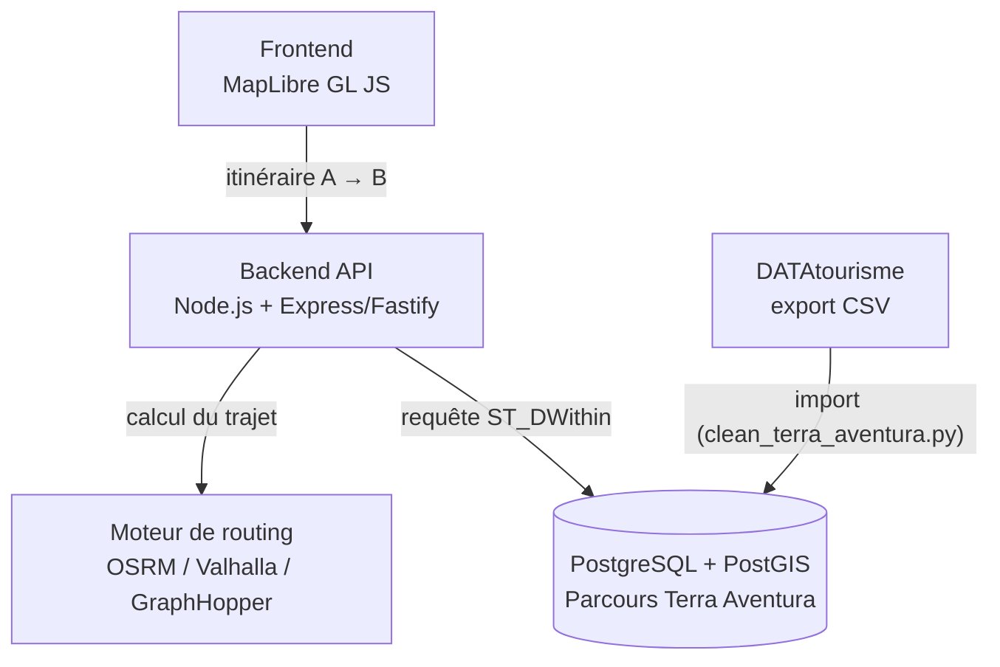

# terra-aventura-radar

Carte interactive permettant de calculer un itinéraire et d'afficher tous les parcours **Terra Aventura** situés sur le trajet ou à moins de X km de la route principale.

> Projet non officiel, sans lien avec le CRT Nouvelle-Aquitaine.
> Les données des parcours proviennent de [DATAtourisme](https://www.datatourisme.fr/) (licence ouverte).

## Architecture



- **Frontend** : carte interactive affichant l'itinéraire et les parcours à proximité.
- **Backend API** : calcule l'itinéraire (via le moteur de routing) puis interroge la base pour trouver les parcours à moins de X km de ce trajet.
- **Moteur de routing** : calcule la géométrie de l'itinéraire entre deux points.
- **Base de données** : stocke les parcours Terra Aventura (nom, position, métadonnées) avec index spatial pour des requêtes de proximité rapides.

## Technologies

| Brique                 | Techno                                                                    |
| ---------------------- | ------------------------------------------------------------------------- |
| Carte                  | [MapLibre GL JS](https://maplibre.org/)                                   |
| Backend                | [Node.js](https://nodejs.org/) avec [Express](https://expressjs.com/)     |
| Routing                | [GraphHopper](https://www.graphhopper.com/)                               |
| Base de données        | PostgreSQL + [PostGIS](https://postgis.net/)                              |
| Données Terra Aventura | [DATAtourisme](https://www.datatourisme.fr/) (Licence Ouverte Etalab 2.0) |

## Récupération des données Terra Aventura

Les parcours Terra Aventura ne sont pas fournis avec ce dépôt (les données DATAtourisme sont mises à jour régulièrement).  
Pour les récupérer :

1. Aller sur [data.gouv.fr](https://www.data.gouv.fr/datasets/donnees-touristiques-de-la-base-datatourisme) ou [explore.datatourisme.fr](https://explore.datatourisme.fr) et filtrer sur les parcours Terra Aventura en Nouvelle-Aquitaine.
2. Télécharger l'export au format **CSV**.
3. Placer le fichier téléchargé à la racine du dépôt.
4. Lancer le script de nettoyage :

   ```bash
   $ python clean_terra_aventura.py datatourisme.csv
    523 lignes lues depuis datatourisme.csv
      25 lignes retirées car le nom ne correspond pas à "Terra/Tèrra Aventura", ex: ["L'Avventura", 'Terrae', 'Ganadéria Aventura', 'Terra Cota', 'Terra Sudoris']
    498 lignes correspondant réellement à Terra Aventura
    495 circuits uniques après déduplication (3 doublons Produit/Lieu retirés)
    Export terminé : datatourisme.geojson (495 points)
   ```

   Ce script corrige l'encodage du fichier, retire les doublons (un même circuit peut apparaître deux fois dans l'export : une fois comme "Produit", une fois comme "Lieu"), et génère un fichier `mon_export.geojson` prêt à être importé dans la base PostGIS.

## Statut du projet

En cours de construction.
