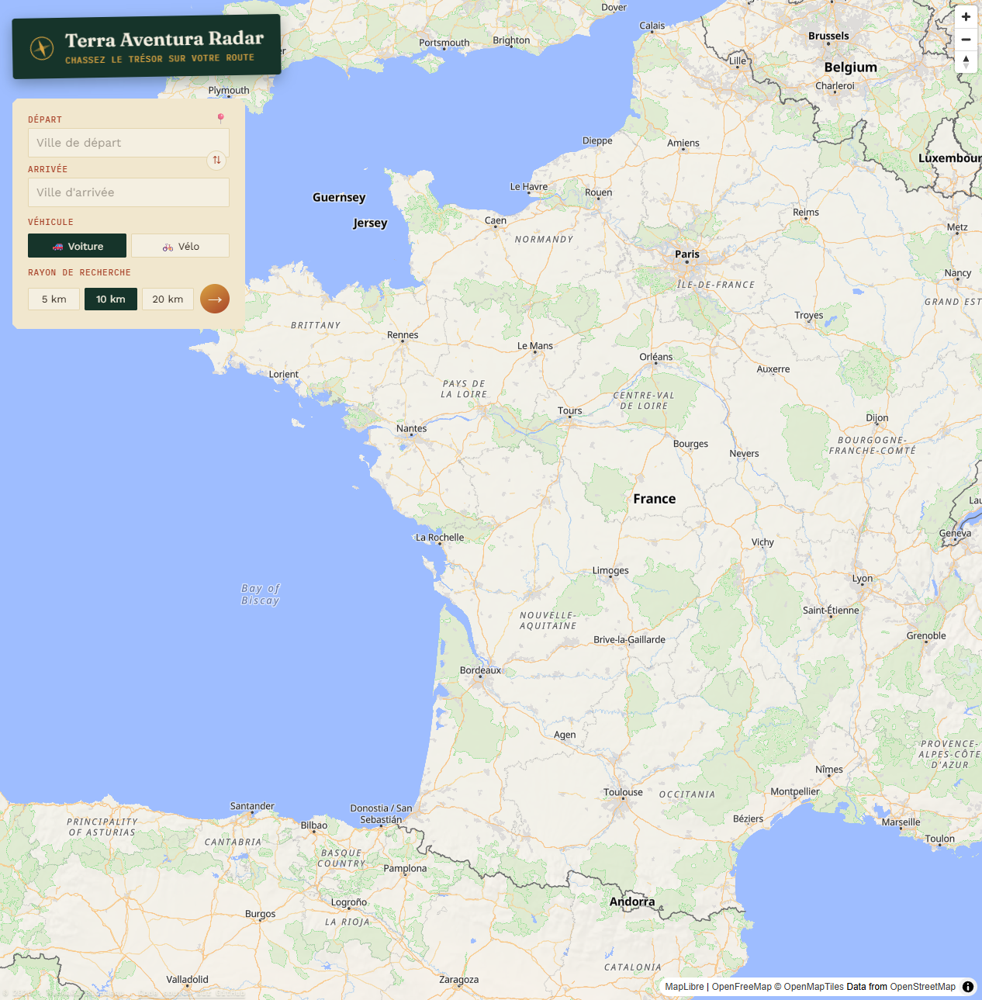
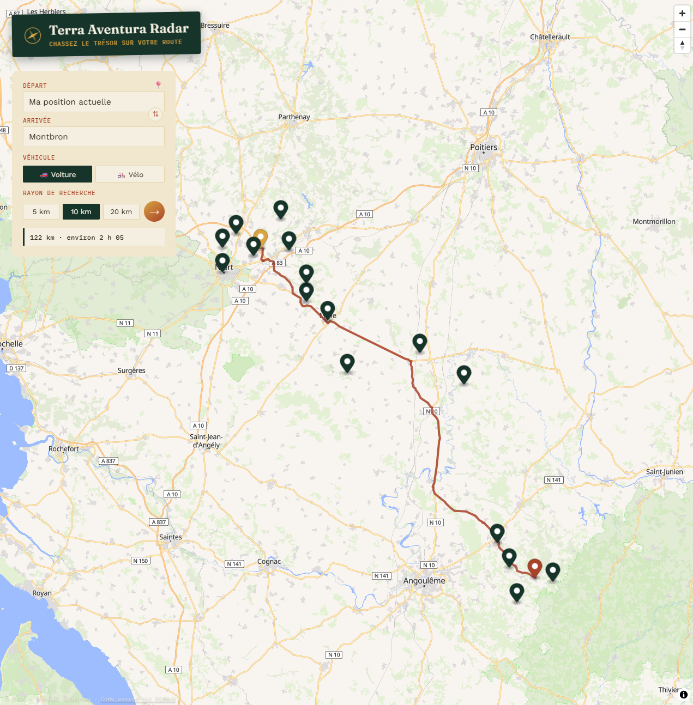
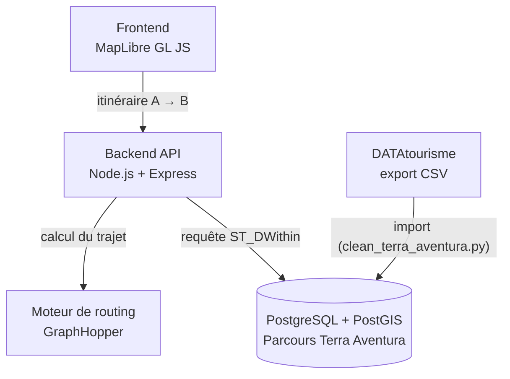
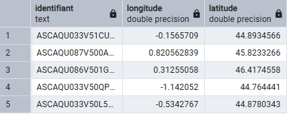

<p align="center">
  
</p>

<p align="center">
  <a href="https://terra-aventura-radar.vercel.app/">
    
  </a>
</p>

# terra-aventura-radar

Carte interactive permettant de calculer un itinéraire et d'afficher tous les parcours **Terra Aventura** situés sur le trajet ou à moins de X km de la route principale.

> Projet non officiel, sans lien avec le CRT Nouvelle-Aquitaine.
> Les données des parcours proviennent de [DATAtourisme](https://www.datatourisme.fr/) (licence ouverte).

## De quoi ça a l'air ?

  


## Architecture



- **Frontend** : carte interactive affichant l'itinéraire et les parcours à proximité.
- **Backend API** : calcule l'itinéraire (via le moteur de routing) puis interroge la base pour trouver les parcours à moins de X km de ce trajet.
- **Moteur de routing** : calcule la géométrie de l'itinéraire entre deux points.
- **Base de données** : stocke les parcours Terra Aventura (nom, position, métadonnées) avec index spatial pour des requêtes de proximité rapides.

## Technologies

| Brique                 | Techno                                                                    |
| ---------------------- | ------------------------------------------------------------------------- |
| Carte                  | [MapLibre GL JS](https://maplibre.org/)                                   |
| Backend                | [Node.js](https://nodejs.org/) avec [Express](https://expressjs.com/)     |
| Routing                | [GraphHopper](https://www.graphhopper.com/)                               |
| Base de données        | PostgreSQL + [PostGIS](https://postgis.net/)                              |
| Données Terra Aventura | [DATAtourisme](https://www.datatourisme.fr/) (Licence Ouverte Etalab 2.0) |

## Récupération des données Terra Aventura

Les parcours Terra Aventura ne sont pas fournis avec ce dépôt (les données DATAtourisme sont mises à jour régulièrement).  
Pour les récupérer :

1. Aller sur [data.gouv.fr](https://www.data.gouv.fr/datasets/donnees-touristiques-de-la-base-datatourisme) ou [explore.datatourisme.fr](https://explore.datatourisme.fr) et filtrer sur les parcours Terra Aventura en Nouvelle-Aquitaine.
2. Télécharger l'export au format **CSV**.
3. Placer le fichier téléchargé à la racine du dépôt.
4. Lancer le script de nettoyage :

   ```bash
   $ python clean_terra_aventura.py datatourisme.csv
    523 lignes lues depuis datatourisme.csv
      25 lignes retirées car le nom ne correspond pas à "Terra/Tèrra Aventura", ex: ["L'Avventura", 'Terrae', 'Ganadéria Aventura', 'Terra Cota', 'Terra Sudoris']
    498 lignes correspondant réellement à Terra Aventura
    495 circuits uniques après déduplication (3 doublons Produit/Lieu retirés)
    Export terminé : datatourisme.geojson (495 points)
   ```

   Ce script corrige l'encodage du fichier, retire les doublons (un même circuit peut apparaître deux fois dans l'export : une fois comme "Produit", une fois comme "Lieu"), et génère un fichier `mon_export.geojson` prêt à être importé dans la base PostGIS.

## Détails du projet

3 répertoires : datas, backend et frontend.

### Datas

<i>WIP : à automatiser</i>

1. Fichier CSV récupéré
2. Transformer le fichier CSV en geojson
3. Installer PostgreSQL avec PostGIS (dans les « Spatial Extensions » du Stack Builder installé avec postgre) : https://postgresql.org/download/
4. Créer une database `terra_aventura_radar_db`
5. Créer la table :

```sql
CREATE TABLE terra_aventura (
    id SERIAL PRIMARY KEY,
    identifiant TEXT UNIQUE,
    nom TEXT NOT NULL,
    commune TEXT,
    code_postal TEXT,
    departement TEXT,
    region TEXT,
    site_internet TEXT,
    createur TEXT,
    geom GEOMETRY(Point, 4326) NOT NULL
);

CREATE INDEX idx_terra_aventura_geom ON terra_aventura USING GIST (geom);
```

5. Installer [GDAL](https://www.osgeo.org/projects/osgeo4w/) pour récupérer [ogr2ogr](https://gdal.org/en/stable/programs/ogr2ogr.html)
6. Insérer les données dans une table temporaire (nommée ici terra_aventura_import) de la base depuis le fichier csv :

```bash
$ cd datas
$ ogr2ogr -f "PostgreSQL" "PG:host=localhost dbname=terra_aventura_radar_db user=postgres password=MOT_DE_PASSE" datatourisme.geojson -nln terra_aventura_import -nlt POINT
```

7. Déplacer les données brutes de la table temporaire vers la table `terra_aventura` précédemment créée.

```sql
INSERT INTO terra_aventura (
    identifiant,
    nom,
    commune,
    code_postal,
    departement,
    region,
    site_internet,
    createur,
    geom
)
SELECT
    identifiant,
    nom,
    commune,
    code_postal,
    departement,
    region,
    NULLIF(site_internet, ''),
    createur,
    wkb_geometry
FROM terra_aventura_import;
```

8. Suppression de la table temporaire :

```sql
DROP TABLE terra_aventura_import;
```

> 💡 **Astuce : retrouver les coordonnées GPS**
>
> Le champ `geom` contient les coordonnées sous forme de `geometry(Point, 4326)`.  
> Pour retrouver facilement la longitude et la latitude :
>
> ```sql
> SELECT
>     identifiant,
>     ST_X(geom) AS longitude,
>     ST_Y(geom) AS latitude
> FROM terra_aventura;
> ```
>
> 

### Backend

<i>Doc en cours</i>

.env à compléter (voir exemple avec .env.example)

```bash
$ cd backend/
$ node server.js
```

Pour géocoder les villes à marquer, on appelle [Nominatim](https://nominatim.org/).  
Puis pour calculer l'itinéraire, on utilise [GraphHopper](https://graphhopper.com).

### Frontend

<i>Doc en cours</i>

```bash
$ cd frontend/
$ npm run dev
```

## Hébergement et CI

### CI

<i>WIP</i>

### Hébergement

<i>WIP</i>

- Database : [Supabase](https://supabase.com/)
- Backend : https://terra-aventura-radar.onrender.com/api/health sur [Render](https://render.com)
- Frontend : https://terra-aventura-radar.vercel.app/ sur [Vercel](https://vercel.com/)
